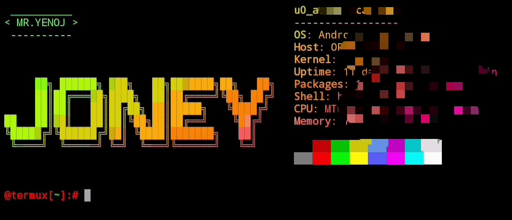

# TeRmUxStYle v1.5
This is a cool terminal for termux user. 
## ABOUT:-
this is a best termux interface. with slow motion this is the one of the best interfae.
### its show like this

### follow these steps:-
# warning
<details>
<summary> If you are don't using hacker keyboard then you can add termux button by this. 
</summary>
<pre>
Do these steps
1. pkg install nano -y
2. nano j
3. past this command:-
Bano="mkdir"
echo ""
$Bano /$HOME/.termux
echo "extra-keys = [['/','cd','$','*','UP','chmod','pkg install'],['exit','CTRL','bash','LEFT','DOWN','RIGHT','y']]" >> $HOME/.termux/termux.properties
clear
4. Then, ctrl+x, then y, then enter. 
5. Last step, bash j
</details>
</pre>


```
```
pkg install git nano -y
```
```
git clone https://github.com/Mr-YENOJ/TeRmUxStYlE
```
```
now,exit from termux and go to this website http://patorjk.com/software/taag/#p=display&f=ANSI%20Shadow&t=Type%20Something%20
type your name and copy all 
```
```
now came back to termux and cd TeRmUxStYlE
```
```
ls
```
```
bash TS.sh
```
```
now you can see a new screen and the starting line be like $the_cow = <<EOC. simply past the copy text(that you copy) between the $throughts and EOC.
```
after pasting the you want to do ctrl+x,then y,then enter.
```
```
```
```
Now, small process is left. 
Now, you want to restart you termux. 
After restarting you want to do these command:-
cd TeRmUxStYlE
then bash TS1.sh
Then do these changes 👇👇
```
```
now you want do some changes in the last line👇👇👇 
```
```
1) add this $ in the start of bracket.
```
```
2) add this " before $ and after bracket
```
```
ex- 
before edit :- neofetch --ascii (fortune | cowsay -f name MR.YENOJ ) | lolcat --animate
after edit :- neofetch --ascii "$(fortune | cowsay -f name MR.YENOJ )" | lolcat --animate
{mr.yenoj is that name that you type}
after do these changes you want to co ctrl+x and then y and then enter
```

# thanku
# now you can restart your termux
 
